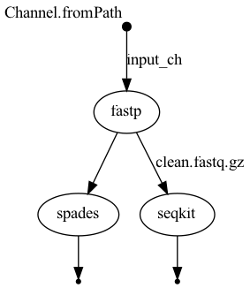

# BIOL7210 - ex#7 Workflow 

Platform: macOS Apple Silicon (M3)  
Nextflow Version: 24.10.5  
Docker: Enabled (`--platform linux/amd64`)

---

## Description

This repository contains a small genomics workflow implemented in **Nextflow DSL2**, designed for **local execution** with both **sequential** and **parallel** processing steps. It includes:

- **Module 1 (fastp)**: Quality trimming of raw FASTQ reads  
- **Module 2 (spades)**: Genome assembly from fastp output (sequential)  
- **Module 3 (seqkit)**: Read statistics from fastp output (parallel)

---

## Quickstart Instructions

### 1. Clone this repository

```bash
git clone git@github.com:xyuan99/my-wf-repo.git
```

### 2. Activate Nextflow environment

```bash
conda create -n nf -c bioconda nextflow -y
conda activate nf
```

### 3. Run the workflow with Docker (Apple Silicon compatible)

```bash
nextflow run main.nf -profile test,docker
```

---

## Test Dataset

- File: `data/minidata.fastq.gz`
- Description: A small single-end FASTQ file (≥ 20,000 lines recommended) for testing
- Note: Replace the placeholder file with your actual test FASTQ

---

## Docker Containers Used

| Tool    | Docker Image |
|---------|--------------|
| fastp   | `quay.io/biocontainers/fastp:0.20.1--h8b12597_0` |
| spades  | `staphb/spades:latest` |
| seqkit  | `quay.io/biocontainers/seqkit:2.3.1--h9ee0642_0` |

---

## DAG Workflow Diagram

Below is the DAG diagram illustrating the sequential and parallel steps in the workflow:



To generate this diagram, use command below:

```bash
nextflow run main.nf -profile test,docker -with-dag dag.png
```
